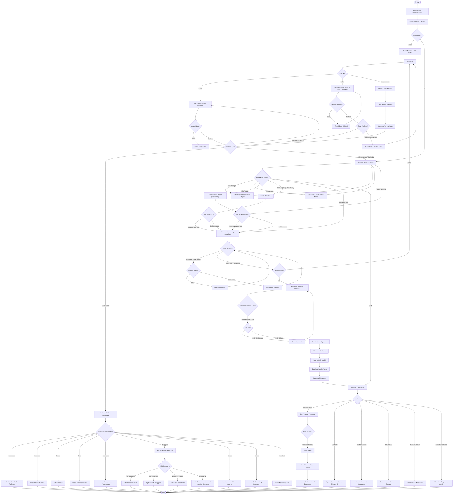
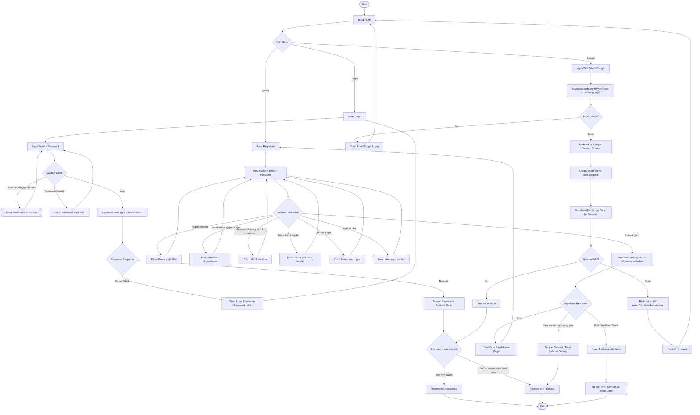
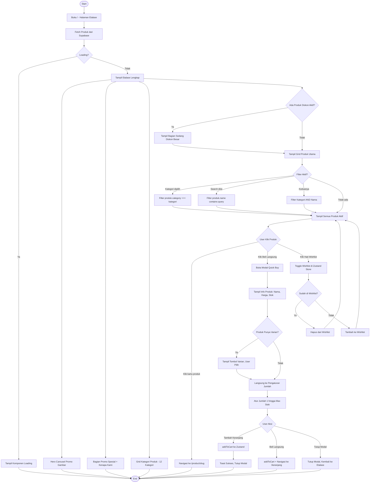
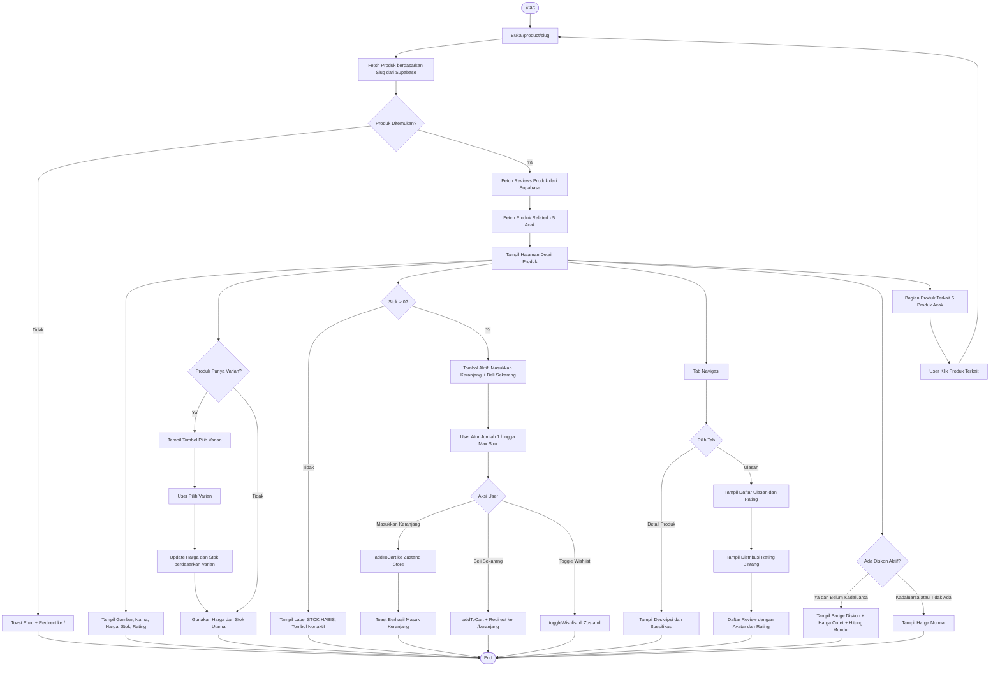
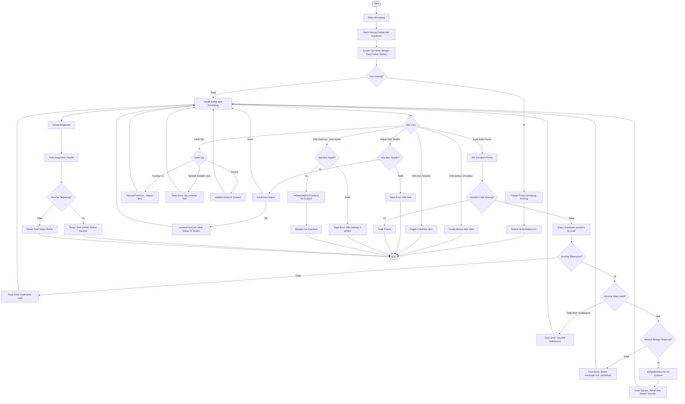
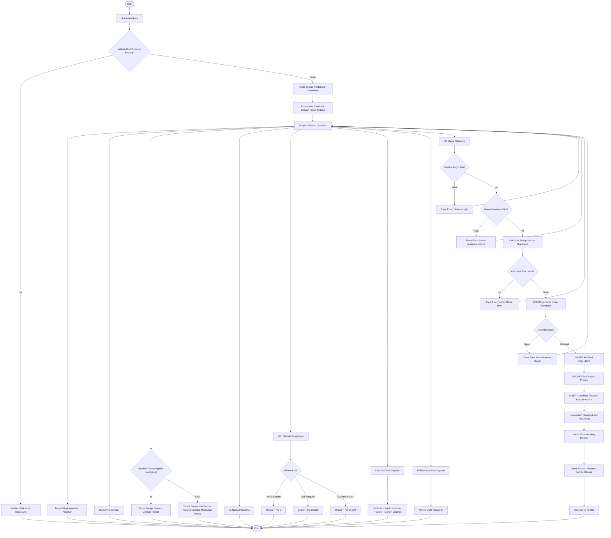
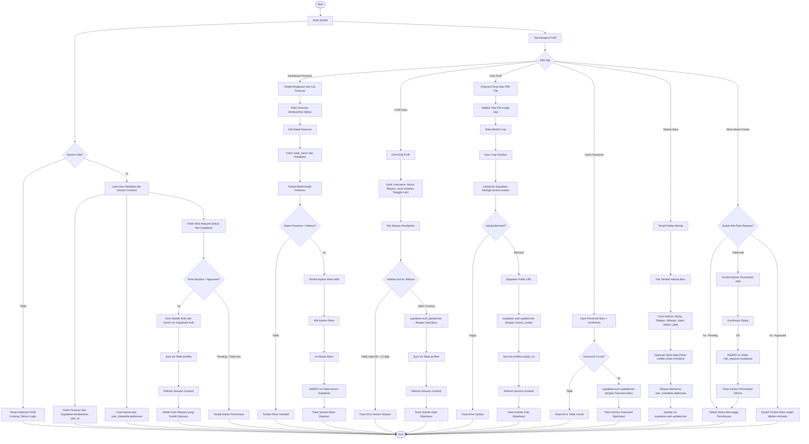
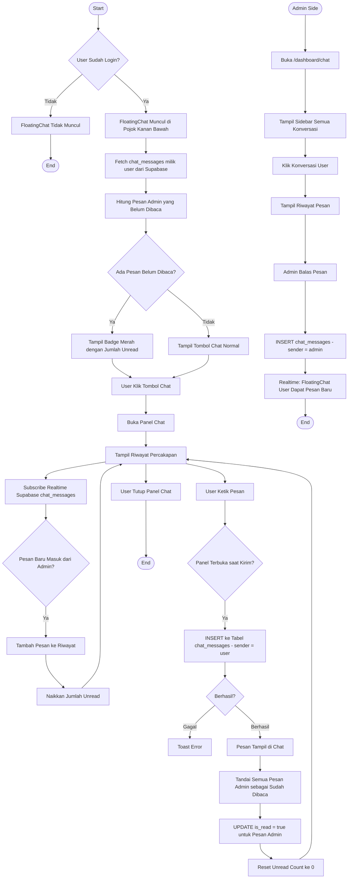
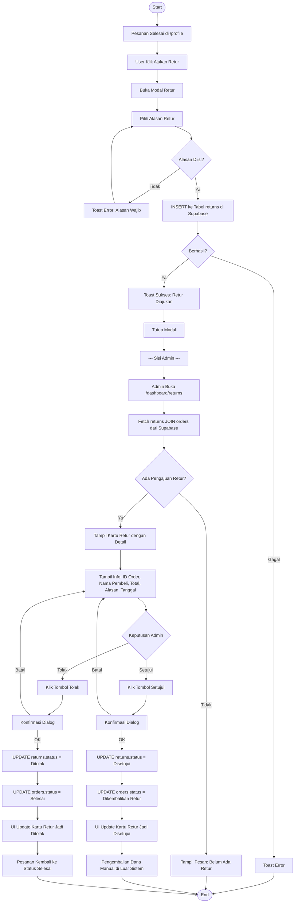

# SembakoBerkah — Sistem E-Commerce Toko Sembako

Ini adalah project e-commerce lengkap untuk toko sembako yang dibangun menggunakan **Next.js (App Router)**, **Supabase**, dan **Zustand**. 

Sistem ini mendukung dua role (User & Owner), realtime chat, notifikasi pesanan, manajemen stok, dan laporan keuangan otomatis.

## 🚀 Fitur Utama
- **Autentikasi**: Email/Password & Google OAuth (Supabase Auth).
- **Manajemen Keranjang & Checkout**: Validasi stok realtime, voucher diskon.
- **Dashboard Admin**: CRUD produk, manajemen pesanan, retur, pengguna, dan laporan laba-rugi.
- **Realtime Chat**: Customer service realtime antara pelanggan dan admin.
- **Notifikasi**: Pemberitahuan pesanan baru untuk admin secara otomatis.

---

## 🛠️ Tech Stack

| Layer | Teknologi |
|---|---|
| **Framework** | Next.js 14 (App Router) |
| **Database & Backend** | Supabase (PostgreSQL, Auth, Storage, Realtime) |
| **State Management** | Zustand + Persist (localStorage) |
| **Styling** | Vanilla CSS + Custom UI Components |
| **Charts** | Chart.js + react-chartjs-2 |

---

## 💻 Cara Menjalankan Project Secara Lokal

1. **Clone repository ini**
   ```bash
   git clone <url-repo>
   cd SembakoBerkah
   ```

2. **Install dependencies**
   ```bash
   npm install
   # atau
   yarn install
   ```

3. **Siapkan Environment Variables**
   Buat file `.env.local` di root folder dan tambahkan kredensial Supabase Anda:
   ```env
   NEXT_PUBLIC_SUPABASE_URL=your-supabase-url
   NEXT_PUBLIC_SUPABASE_ANON_KEY=your-supabase-anon-key
   ```

4. **Jalankan Development Server**
   ```bash
   npm run dev
   ```
   Buka [http://localhost:3000](http://localhost:3000) di browser Anda.

---

## 📚 Dokumentasi Alur Sistem (Flowcharts)

Berikut adalah hasil *reverse engineering* dari arsitektur dan alur logika sistem SembakoBerkah.

### 1. Flowchart Sistem Utama

> Alur lengkap keseluruhan sistem dari halaman utama hingga interaksi user & admin.



---

### 2. Login & Registrasi

> Validasi sisi client dan autentikasi dengan Supabase (Email & Google).



---

### 3. Etalase / Storefront

> Halaman utama, filter kategori, dan fitur beli langsung (quick buy).



---

### 4. Detail Produk

> Detail produk, pilihan varian, cek stok realtime, dan ulasan pelanggan.



---

### 5. Keranjang Belanja

> Manajemen item di keranjang, ubah kuantitas, dan validasi voucher diskon.



---

### 6. Checkout & Pembayaran

> Kalkulasi ongkir, pemotongan stok otomatis, dan pembuatan order.



---

### 7. Profil Pengguna

> Manajemen alamat, upload avatar, riwayat pesanan, dan request akses admin.



---

### 8. Dashboard Admin

> Pusat kontrol admin untuk CRUD produk, pantau pesanan, keuangan, dan manajemen user.

```mermaid
flowchart TD
    A([Start]) --> B[Buka /dashboard]
    B --> C{Session Valid + Role = owner?}
    C -->|Tidak| D[Redirect ke /auth]
    C -->|Ya| E[Dashboard Layout dengan Sidebar]

    E --> F[Fetch Unread Notifications Count dari Supabase]
    F --> G[Tampil Badge Notif di Header]

    E --> H{Menu Sidebar}
    H -->|Dashboard| I[Halaman /dashboard - Analitik dan Grafik]
    H -->|Pesanan| J[Halaman /dashboard/orders - Manajemen Pesanan]
    H -->|Produk| K[Halaman /dashboard/products - CRUD Produk]
    H -->|Retur| L[Halaman /dashboard/returns - Pengembalian Barang]
    H -->|Keuangan| M[Halaman /dashboard/finance - Laporan Keuangan]
    H -->|Pengguna| N[Halaman /dashboard/users - Manajemen User]
    H -->|Diskon| O[Halaman /dashboard/discounts - Diskon dan Voucher]
    H -->|Pesan| P[Halaman /dashboard/chat - Chat Pelanggan]
    H -->|Notifikasi| Q[Halaman /dashboard/notifications]
    H -->|Lihat Toko| R[Kembali ke / Etalase]

    %% DASHBOARD ANALITIK
    I --> I1[Fetch orders, expenses, profiles, site_visits, products]
    I1 --> I2[Tampil 4 Kartu KPI]
    I2 --> I3[Total Pemasukan dari Semua Pesanan Aktif]
    I2 --> I4[Total Pesanan]
    I2 --> I5[Pesanan Tertunda: status Menunggu]
    I2 --> I6[Stok Kritis: produk stok kurang dari 5]
    I1 --> I7[Grafik Bar: Pemasukan vs Pengeluaran per Bulan]
    I1 --> I8[Grafik Line: Pendaftaran Pengguna Baru per Bulan]
    I1 --> I9[Grafik Line: Kunjungan Website per Bulan]

    %% PESANAN
    J --> J1[Fetch orders dari Supabase - Desc by created_at]
    J1 --> J2[Filter berdasarkan Status + Pencarian]
    J2 --> J3{Aksi Pesanan}
    J3 -->|Update Status| J4[supabase.update orders.status]
    J4 --> J5{Status Baru}
    J5 -->|Belum Bayar| J6[Status: Menunggu Pembayaran]
    J5 -->|Sedang Dikemas| J7[Status: Sedang Dikemas]
    J5 -->|Dikirim| J8[Status: Dalam Pengiriman]
    J5 -->|Selesai| J9[Status: Pesanan Selesai]
    J5 -->|Dibatalkan| J10[Status: Dibatalkan]

    %% PRODUK CRUD
    K --> K1[Fetch products dari Supabase]
    K1 --> K2[Tampil Tabel Produk dengan Pencarian]
    K2 --> K3{Aksi Produk}
    K3 -->|Tambah Baru| K4[Buka Modal Form Produk]
    K4 --> K5[Input: Nama, Harga, HPP, Stok, Kategori, Gambar, Deskripsi]
    K5 --> K6[Tambah Varian Opsional: Nama-Harga-Stok]
    K6 --> K7[Tambah Spesifikasi Opsional: Key-Value]
    K7 --> K8[Upload Gambar ke Supabase Storage]
    K8 --> K9[INSERT ke Tabel products]
    K9 --> K10[Toast Sukses + Refresh Tabel]
    K3 -->|Edit Produk| K11[Buka Modal Form dengan Data Existing]
    K11 --> K5
    K9 --> K12[UPDATE products jika Edit Mode]
    K3 -->|Hapus Produk| K13[Konfirmasi Hapus]
    K13 -->|OK| K14[DELETE dari Tabel products]
    K14 --> K10
    K3 -->|Aktifkan / Nonaktifkan| K15[UPDATE products.status]

    %% RETUR
    L --> L1[Fetch returns JOIN orders dari Supabase]
    L1 --> L2{Ada Retur?}
    L2 -->|Tidak| L3[Tampil Pesan Kosong]
    L2 -->|Ya| L4[Tampil Kartu Retur]
    L4 --> L5{Aksi Retur}
    L5 -->|Setujui| L6[UPDATE returns.status = Disetujui]
    L6 --> L7[UPDATE orders.status = Dikembalikan Retur]
    L5 -->|Tolak| L8[UPDATE returns.status = Ditolak]
    L8 --> L9[UPDATE orders.status = Selesai]

    %% KEUANGAN
    M --> M1[Fetch orders status=Selesai + expenses]
    M1 --> M2[Hitung Omzet dari Pesanan Selesai]
    M2 --> M3[Asumsikan HPP 70 persen dari Omzet]
    M3 --> M4[Total Pengeluaran dari Tabel expenses]
    M4 --> M5[Hitung Laba Bersih = Omzet - HPP - Pengeluaran]
    M5 --> M6[Tampil 4 Kartu: Omzet, Pengeluaran, HPP, Laba Bersih]
    M6 --> M7[Klik Tambah Pengeluaran]
    M7 --> M8[Form: Tanggal, Kategori, Catatan, Jumlah]
    M8 --> M9[INSERT ke Tabel expenses]
    M9 --> M1

    %% PENGGUNA
    N --> N1[Fetch users via RPC get_all_users atau fallback profiles]
    N1 --> N2[Fetch role_requests dari Supabase]
    N2 --> N3{Tab Aktif}
    N3 -->|Pengguna| N4[Tampil Tabel Semua Pengguna]
    N3 -->|Permintaan Owner| N5[Tampil Daftar Role Request]
    N5 --> N6{Aksi}
    N6 -->|Approve| N7[UPDATE role_requests.status = Approved]
    N7 --> N8[UPDATE profiles.role = Owner]
    N8 --> N9[Alert: User akan jadi Owner saat login]
    N6 -->|Reject| N10[UPDATE role_requests.status = Rejected]

    %% DISKON
    O --> O1[Fetch products + vouchers dari Supabase]
    O1 --> O2{Tab Aktif}
    O2 -->|Diskon Produk| O3[Tampil Tabel Produk dengan Input Diskon]
    O3 --> O4{Aksi Diskon}
    O4 -->|Edit Diskon Per Produk| O5[Input % Diskon + Tanggal Berakhir]
    O5 --> O6[UPDATE products.discount + discount_end_date]
    O4 -->|Hapus Diskon| O7[SET discount = 0]
    O4 -->|Bulk Diskon| O8[Input % untuk Semua Produk]
    O8 --> O9[UPDATE semua products.discount]
    O2 -->|Voucher| O10[Tampil Daftar Voucher]
    O10 --> O11[Klik Buat Voucher]
    O11 --> O12[Input: Kode, Jenis, Nilai, Min Belanja, Batas Diskon, Batas Pakai]
    O12 --> O13[INSERT ke Tabel vouchers]
    O10 --> O14[Hapus Voucher]
    O14 --> O15[DELETE dari Tabel vouchers]

    %% CHAT
    P --> P1[Fetch profiles untuk Mapping Nama]
    P1 --> P2[Fetch chat_messages dari Supabase]
    P2 --> P3[Tampil Sidebar Percakapan]
    P3 --> P4[Subscribe Realtime Supabase chat_messages]
    P4 --> P5{Pesan Baru Masuk?}
    P5 -->|Ya| P6[Toast Pesan Baru + Browser Notification]
    P6 --> P3
    P3 --> P7[Klik User di Sidebar]
    P7 --> P8[Tampil Riwayat Pesan dengan User]
    P8 --> P9[Admin Ketik Balasan]
    P9 --> P10[INSERT chat_messages - sender = admin]
    P10 --> P8

    %% NOTIFIKASI
    Q --> Q1[Fetch notifications - Desc by created_at]
    Q1 --> Q2[Tampil List Notifikasi]
    Q2 --> Q3{Aksi}
    Q3 -->|Tandai Dibaca| Q4[UPDATE notifications.unread = false]
    Q3 -->|Tandai Semua Dibaca| Q5[UPDATE semua unread = false]
    Q3 -->|Hapus Notif| Q6[DELETE dari Tabel notifications]

    %% Menambahkan oval End pada titik akhir
    D --> Z_END([End])
    G --> Z_END([End])
    R --> Z_END([End])
    I3 --> Z_END([End])
    I4 --> Z_END([End])
    I5 --> Z_END([End])
    I6 --> Z_END([End])
    I7 --> Z_END([End])
    I8 --> Z_END([End])
    I9 --> Z_END([End])
    J6 --> Z_END([End])
    J7 --> Z_END([End])
    J8 --> Z_END([End])
    J9 --> Z_END([End])
    J10 --> Z_END([End])
    K10 --> Z_END([End])
    K12 --> Z_END([End])
    K15 --> Z_END([End])
    L3 --> Z_END([End])
    L7 --> Z_END([End])
    L9 --> Z_END([End])
    N4 --> Z_END([End])
    N9 --> Z_END([End])
    N10 --> Z_END([End])
    O6 --> Z_END([End])
    O7 --> Z_END([End])
    O9 --> Z_END([End])
    O13 --> Z_END([End])
    O15 --> Z_END([End])
    Q4 --> Z_END([End])
    Q5 --> Z_END([End])
    Q6 --> Z_END([End])

```



---

### 9. Chat Pelanggan (Realtime)

> Fitur live chat antara pengunjung toko dan admin menggunakan Supabase Realtime.



---

### 10. Pengajuan Retur Barang

> Alur komplain dan pengembalian barang dari pelanggan hingga disetujui admin.



---


*Dokumentasi diagram dibuat secara otomatis berdasarkan implementasi kode aktual.*