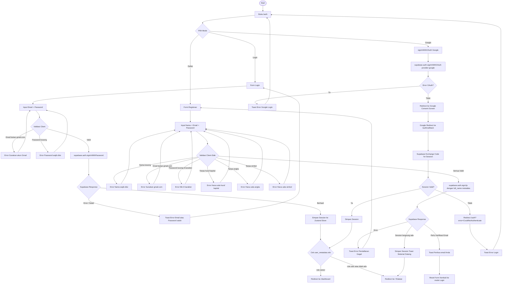
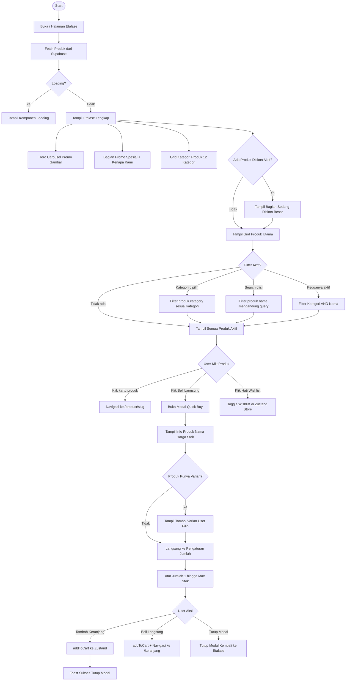
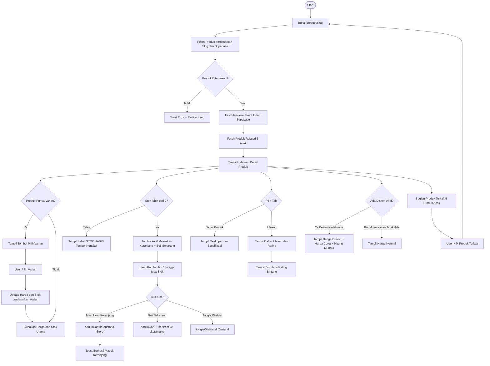
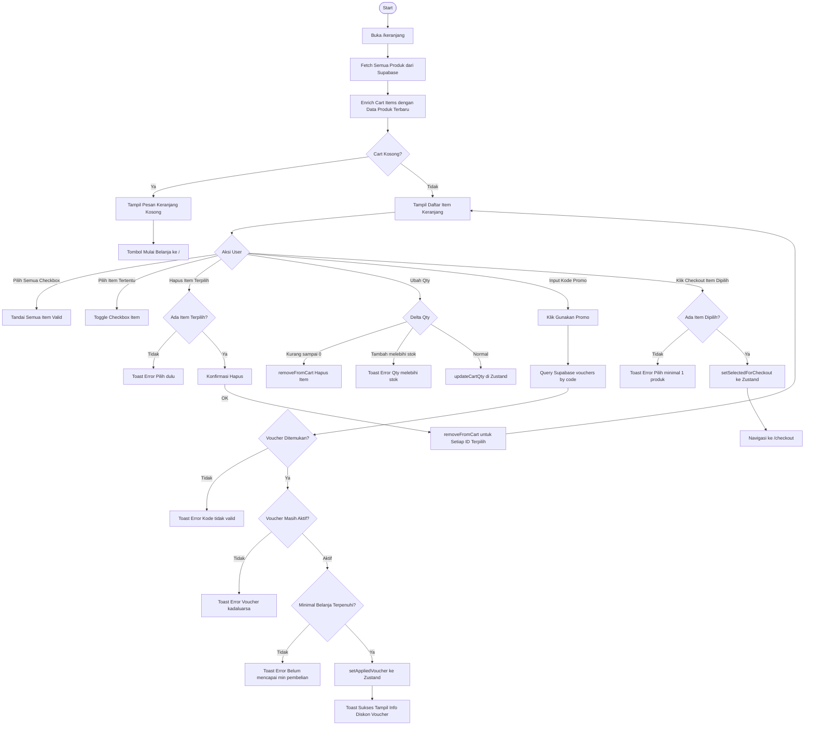
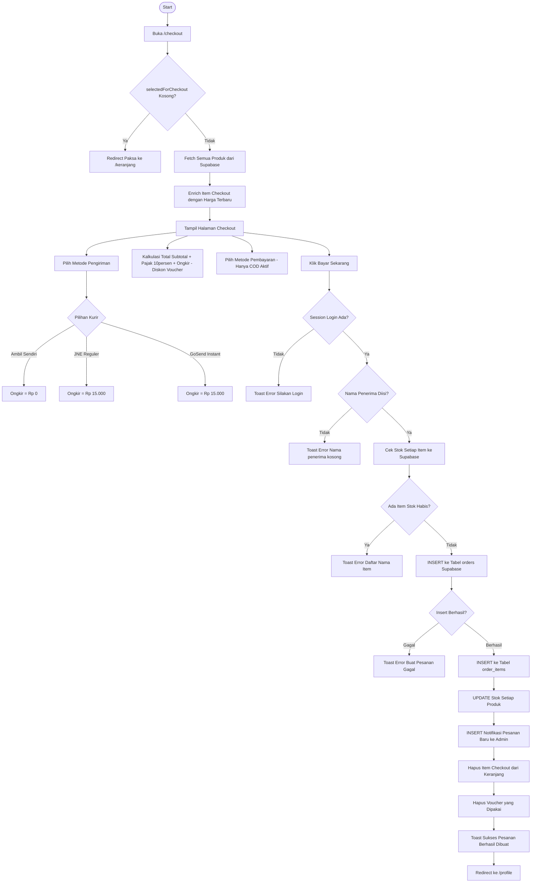
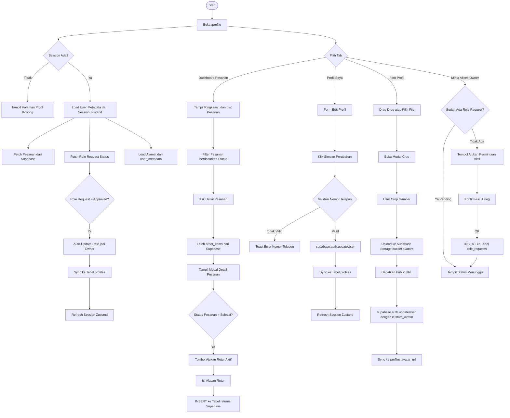
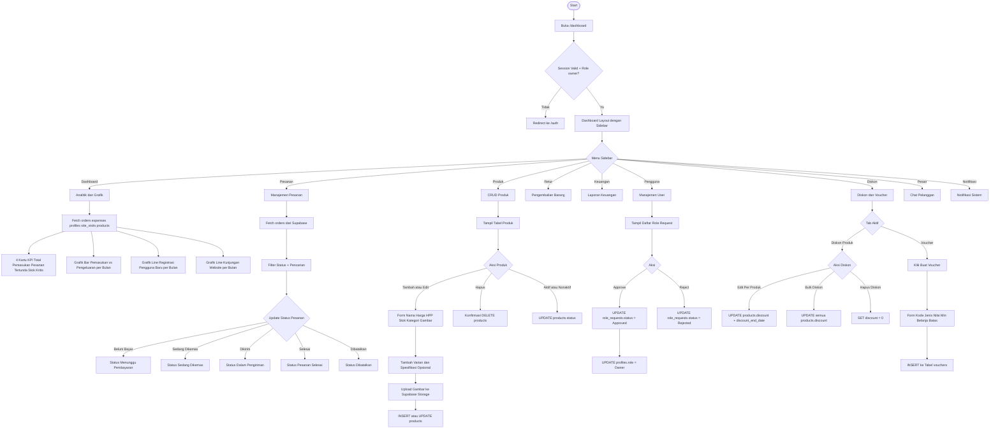
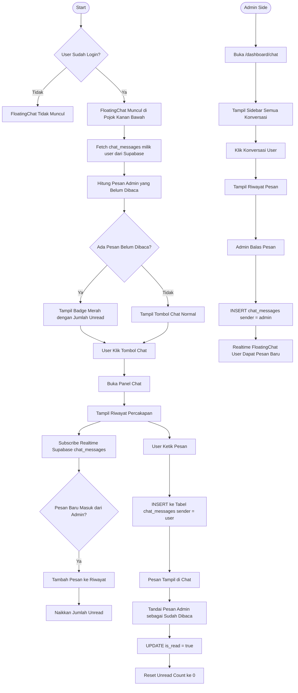
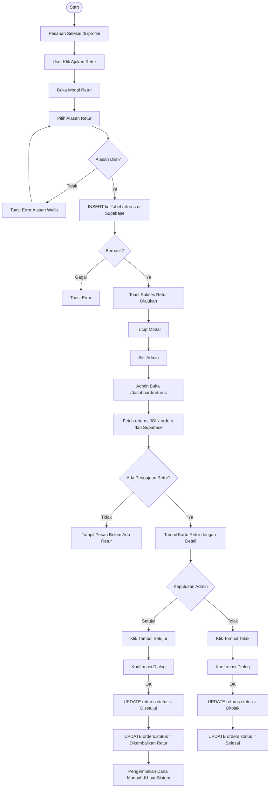

# SembakoBerkah — Dokumentasi Sistem & Flowchart

> Dokumentasi ini dibuat berdasarkan hasil **reverse engineering** source code project SembakoBerkah. Seluruh flowchart sesuai dengan implementasi aktual.

---

## 📋 Deskripsi Singkat Sistem

**SembakoBerkah** adalah aplikasi e-commerce toko sembako online yang dibangun dengan **Next.js (App Router)**, **Supabase** (database + auth + storage + realtime), dan **Zustand** untuk state management.

Sistem memiliki **dua role utama**:
| Role | Akses |
|---|---|
| **User (Pelanggan)** | Etalase, Keranjang, Checkout, Profil, Chat |
| **Owner (Admin)** | Semua akses User + Dashboard Admin penuh |

### Tabel Database Utama (Supabase)

| Tabel | Fungsi |
|---|---|
| `products` | Data produk beserta varian, spesifikasi, diskon |
| `orders` | Data pesanan pelanggan |
| `order_items` | Detail item per pesanan |
| `profiles` | Data profil pengguna |
| `reviews` | Ulasan produk |
| `returns` | Pengajuan pengembalian barang |
| `expenses` | Pengeluaran toko |
| `vouchers` | Kode promo/diskon |
| `chat_messages` | Pesan antara user & admin |
| `notifications` | Notifikasi sistem untuk admin |
| `role_requests` | Permintaan upgrade ke role Owner |
| `site_visits` | Data kunjungan website |

---

## 🗂️ Daftar Flowchart

| No | Nama Flowchart | File | Keterangan |
|---|---|---|---|
| 1 | Sistem Utama | `flowchart-sistem.mmd` | Alur lengkap keseluruhan sistem |
| 2 | Login & Registrasi | `flowchart-login.mmd` | Autentikasi email, Google OAuth |
| 3 | Etalase / Storefront | `flowchart-etalase.mmd` | Halaman utama, filter, quick buy |
| 4 | Detail Produk | `flowchart-produk-detail.mmd` | Halaman produk, varian, ulasan |
| 5 | Keranjang Belanja | `flowchart-keranjang.mmd` | Cart, voucher, checkout |
| 6 | Checkout & Pembayaran | `flowchart-checkout.mmd` | Proses pembuatan pesanan |
| 7 | Profil Pengguna | `flowchart-profil.mmd` | Riwayat pesanan, edit profil, alamat |
| 8 | Dashboard Admin | `flowchart-dashboard.mmd` | Semua fitur halaman admin |
| 9 | Chat Pelanggan | `flowchart-chat.mmd` | FloatingChat user + Admin chat |
| 10 | Retur Barang | `flowchart-retur.mmd` | Pengajuan & persetujuan retur |

---

## Flowchart Mermaid

### 1. Flowchart Sistem Utama

> Menggambarkan alur keseluruhan sistem dari pertama kali buka website hingga semua fitur inti.

```mermaid
flowchart TD
    A([Start]) --> B[Buka Website SembakoBerkah]
    B --> C[Halaman Utama / Etalase]
    C --> D{Sudah Login?}

    D -->|Tidak| E[Tampil Navbar Login / Daftar]
    E --> F[Buka /auth]
    F --> G{Pilih Aksi}
    G -->|Login| H[Form Login Email + Password]
    G -->|Daftar| I[Form Registrasi Nama + Email + Password]
    G -->|Google OAuth| J[Redirect Google OAuth]

    H --> K{Validasi Login}
    K -->|Gagal| L[Tampil Pesan Error]
    L --> H
    K -->|Berhasil| M{Cek Role User}

    I --> N{Validasi Registrasi}
    N -->|Gagal| O[Tampil Error Validasi]
    O --> I
    N -->|Berhasil| P{Email Verifikasi?}
    P -->|Session Langsung| M
    P -->|Perlu Verifikasi Email| Q[Tampil Pesan Periksa Email]
    Q --> F

    J --> R[/auth/callback]
    R --> S[Supabase Auth Callback]
    S --> M

    M -->|Role owner| T[Dashboard Admin /dashboard]
    M -->|Role user atau tidak ada| U[Halaman Utama / Etalase]

    D -->|Ya| U

    U --> V{Pilih Aksi di Etalase}
    V -->|Filter Kategori| W[Filter Produk berdasarkan Kategori]
    V -->|Cari Produk| X[Cari Produk berdasarkan Nama]
    V -->|Klik Produk| Y[Halaman Detail Produk /product/slug]
    V -->|Beli Langsung Quick Buy| Z[Modal Quick Buy]
    V -->|Lihat Keranjang| AA[Halaman Keranjang /keranjang]
    V -->|Profil| BB[Halaman Profil /profile]

    W --> U
    X --> U
    Y --> CC{Aksi di Detail Produk}
    CC -->|Tambah ke Keranjang| AA
    CC -->|Beli Langsung| AA
    CC -->|Toggle Wishlist| U

    Z --> ZZ{Pilih Varian + Qty}
    ZZ -->|Tambah Keranjang| AA
    ZZ -->|Beli Langsung| AA

    AA --> DD{Aksi di Keranjang}
    DD -->|Masukkan Kode Promo| EE{Validasi Voucher}
    EE -->|Valid| FF[Diskon Terpasang]
    EE -->|Tidak Valid| GG[Pesan Error Voucher]
    FF --> DD
    GG --> DD
    DD -->|Pilih Item + Checkout| HH{Session Login?}
    HH -->|Tidak| F
    HH -->|Ya| II[Halaman Checkout /checkout]

    II --> JJ{Isi Nama Penerima + Kurir}
    JJ -->|Klik Bayar Sekarang| KK{Cek Stok}
    KK -->|Stok Tidak Cukup| LL[Error Stok Habis]
    LL --> II
    KK -->|Stok Cukup| MM[Buat Order di Supabase]
    MM --> NN[Simpan Order Items]
    NN --> OO[Kurangi Stok Produk]
    OO --> PP[Buat Notifikasi ke Admin]
    PP --> QQ[Hapus dari Keranjang]
    QQ --> BB

    BB --> RR{Tab Profil}
    RR -->|Pesanan Saya| SS[List Pesanan Pengguna]
    RR -->|Edit Profil| TT[Update Username Nama Telepon dll]
    RR -->|Ganti Password| UU[Update Password Supabase]
    RR -->|Upload Foto| VV[Crop dan Upload Avatar ke Storage]
    RR -->|Tambah Alamat| WW[Form Alamat + Map Picker]
    RR -->|Minta Akses Owner| XX[Kirim Role Request ke Admin]

    SS --> YY{Pesanan Selesai?}
    YY -->|Ya| ZZ2[Ajukan Retur]
    ZZ2 --> AAA[Data Masuk ke Tabel returns]
    AAA --> BBB[Admin Review Retur di Dashboard]

    T --> CCC{Menu Dashboard Admin}
    CCC -->|Dashboard| DDD[Analitik dan Grafik Performa]
    CCC -->|Pesanan| EEE[Kelola Status Pesanan]
    CCC -->|Produk| FFF[CRUD Produk]
    CCC -->|Retur| GGG[Kelola Permintaan Retur]
    CCC -->|Keuangan| HHH[Laporan Keuangan dan Pengeluaran]
    CCC -->|Pengguna| III[Kelola User dan Role Request]
    CCC -->|Diskon| JJJ[Set Diskon Produk dan Voucher]
    CCC -->|Pesan| KKK[Chat Realtime dengan Pelanggan]
    CCC -->|Notifikasi| LLL[Kelola Notifikasi Sistem]

    III --> MMM{Aksi Role Request}
    MMM -->|Approve| NNN[Update Role Profil jadi Owner]
    MMM -->|Reject| OOO[Tolak Permintaan]
```

---

### 2. Flowchart Login & Registrasi

> Mencakup tiga metode autentikasi: Email+Password, Registrasi, dan Google OAuth. Validasi dilakukan di sisi client sebelum dikirim ke Supabase.



---

### 3. Flowchart Etalase / Storefront

> Halaman utama `/` dengan fitur filter kategori, pencarian, produk diskon, dan quick buy modal.



---

### 4. Flowchart Detail Produk

> Halaman `/product/[slug]` dengan varian, stok, diskon countdown, ulasan, dan produk terkait.



---

### 5. Flowchart Keranjang Belanja

> Halaman `/keranjang` dengan seleksi item, update qty, penerapan voucher/promo, dan lanjut checkout.



---

### 6. Flowchart Checkout & Pembayaran

> Halaman `/checkout` dengan validasi stok, pembuatan pesanan ke Supabase, update stok, dan notifikasi admin.



---

### 7. Flowchart Profil Pengguna

> Halaman `/profile` dengan tab: Pesanan, Edit Profil, Upload Foto, Ganti Password, Alamat, dan Minta Akses Owner.



---

### 8. Flowchart Dashboard Admin

> Halaman `/dashboard` dan semua sub-halaman admin: Pesanan, Produk CRUD, Retur, Keuangan, Pengguna, Diskon, Chat, Notifikasi.



---

### 9. Flowchart Chat Pelanggan

> FloatingChat component (sisi user) dan halaman `/dashboard/chat` (sisi admin) dengan Supabase Realtime.



---

### 10. Flowchart Retur Barang

> Alur pengajuan retur oleh user dari `/profile` hingga persetujuan/penolakan oleh admin di `/dashboard/returns`.



---

## 📁 Struktur File Dokumentasi

```
docs/
├── README.md                      ← Dokumentasi ini
├── flowchart-sistem.mmd           ← Flowchart utama keseluruhan sistem
├── flowchart-login.mmd            ← Flowchart login & registrasi
├── flowchart-etalase.mmd          ← Flowchart halaman utama etalase
├── flowchart-produk-detail.mmd    ← Flowchart halaman detail produk
├── flowchart-keranjang.mmd        ← Flowchart keranjang belanja
├── flowchart-checkout.mmd         ← Flowchart proses checkout
├── flowchart-profil.mmd           ← Flowchart halaman profil pengguna
├── flowchart-dashboard.mmd        ← Flowchart dashboard admin lengkap
├── flowchart-chat.mmd             ← Flowchart fitur chat realtime
└── flowchart-retur.mmd            ← Flowchart pengajuan retur barang
```

---

## 🛠️ Tech Stack

| Layer | Teknologi |
|---|---|
| Framework | Next.js 14 (App Router) |
| Database | Supabase (PostgreSQL) |
| Auth | Supabase Auth (Email + Google OAuth) |
| Storage | Supabase Storage (avatars, product images) |
| Realtime | Supabase Realtime (chat, notifikasi) |
| State | Zustand + Persist (localStorage) |
| UI | Vanilla CSS + Custom Components |
| Charts | Chart.js + react-chartjs-2 |
| Maps | Leaflet (via MapPicker component) |

---

*Dokumentasi dibuat otomatis via reverse engineering source code — SembakoBerkah Project*
